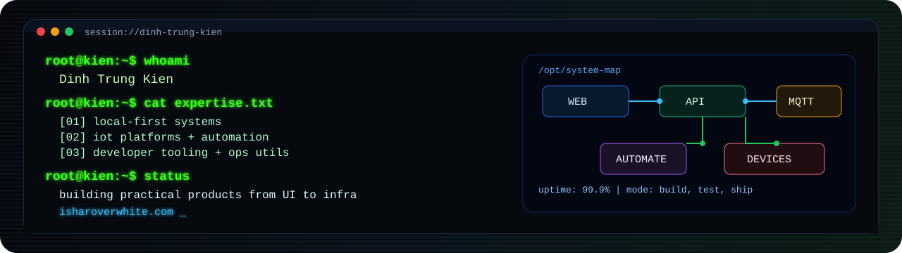

<p align="center">
  
</p>

<p align="center">
  
  
  
  
</p>

```bash
root@kien:~$ ./profile --dump
{
  "name": "Dinh Trung Kien",
  "role": "Fullstack Intern Developer,
  "location": "Ha Long, Quang Ninh, Vietnam",
  "education": "Computer Science @ University of Greenwich Vietnam",
  "mission": "Build self-hosted systems that are practical, operable, and user-owned."
}
```

## `$ ls -1 focus/`

- `local-first platforms` - keep control and data near the owner
- `iot + automation` - real-time device workflows and orchestration
- `developer tooling` - utilities that reduce operational friction
- `full-stack delivery` - from UI and API to deployment and runtime

## `$ cat featured_projects.log`

Selected public work updated in the last 12 months as of `May 26, 2026`.

<table>
  <tr>
    <td width="50%" valign="top">
      <h3><code>~/projects/e-connect</code></h3>
      <p>
        <a href="https://github.com/isharoverwhite/E-Connect"><strong>E-Connect</strong></a><br />
        Self-hosted smart home platform with secure onboarding, real-time control, browser-based ESP32 workflow, and visual automation graph.
      </p>
      <p><code>Next.js</code> <code>TypeScript</code> <code>FastAPI</code> <code>Python</code> <code>Docker</code></p>
    </td>
    <td width="50%" valign="top">
      <h3><code>~/projects/container-control</code></h3>
      <p>
        <a href="https://github.com/isharoverwhite/Container_control"><strong>Container Control</strong></a><br />
        Docker operations platform with web/mobile clients, live logs, terminal access, system metrics, and remote control workflows.
      </p>
      <p><code>Node.js</code> <code>Next.js</code> <code>Flutter</code> <code>Socket.IO</code> <code>Docker</code></p>
    </td>
  </tr>
  <tr>
    <td width="50%" valign="top">
      <h3><code>~/projects/clean-my-logs</code></h3>
      <p>
        <a href="https://github.com/isharoverwhite/CleanMyLogs"><strong>CleanMyLogs</strong></a><br />
        Native macOS menu-bar utility to monitor and clean logs, caches, Xcode artifacts, and developer junk safely.
      </p>
      <p><code>SwiftUI</code> <code>SPM</code> <code>macOS</code></p>
    </td>
    <td width="50%" valign="top">
      <h3><code>~/projects/native-nature-scrolling</code></h3>
      <p>
        <a href="https://github.com/isharoverwhite/ASNaturalScrolling"><strong>NativeNatureScrolling</strong></a><br />
        Event-level macOS utility that preserves trackpad behavior and reverses mouse wheel scrolling through input classification.
      </p>
      <p><code>Swift</code> <code>AppKit</code> <code>Event Taps</code></p>
    </td>
  </tr>
  <tr>
    <td width="50%" valign="top">
      <h3><code>~/projects/maria-mcp</code></h3>
      <p>
        <a href="https://github.com/isharoverwhite/MariaMCP"><strong>MariaMCP</strong></a><br />
        MCP server for MariaDB/MySQL so AI agents can connect via runtime credentials and execute controlled local database workflows.
      </p>
      <p><code>Python</code> <code>MCP</code> <code>MariaDB</code> <code>MySQL</code></p>
    </td>
    <td width="50%" valign="top">
      <h3><code>~/projects/workstream</code></h3>
      <p>
        Active side-track repositories:
        <a href="https://github.com/isharoverwhite/Banime40">Banime40</a>,
        <a href="https://github.com/isharoverwhite/macOS_Tool">macOS_Tool</a>,
        <a href="https://github.com/isharoverwhite/Screen-manager">Screen-manager</a>,
        <a href="https://github.com/isharoverwhite/PPC_Tool">PPC_Tool</a>,
        <a href="https://github.com/isharoverwhite/Skills">Skills</a>.
      </p>
      <p>These are usually where new ideas are tested before formalizing into larger products.</p>
    </td>
  </tr>
</table>

## `$ stack --print`

<p align="center">
  
</p>

```text
languages: TypeScript, JavaScript, Python, Dart, Swift, C#, Kotlin, C/C++
frameworks: Next.js, React, FastAPI, Flutter
infra/tools: Docker, Linux, Jenkins, Firebase
datastores: MongoDB, MySQL, SQLite
```

<details>
  <summary><strong><code>$ git activity --since=2025-05-26 --until=2026-05-26</code></strong></summary>
  <ul>
    <li><a href="https://github.com/isharoverwhite/Banime40">Banime40</a> - pushed on May 26, 2026</li>
    <li><a href="https://github.com/isharoverwhite/E-Connect">E-Connect</a> - pushed on May 23, 2026</li>
    <li><a href="https://github.com/isharoverwhite/macOS_Tool">macOS_Tool</a> - pushed on May 21, 2026</li>
    <li><a href="https://github.com/isharoverwhite/Screen-manager">Screen-manager</a> - pushed on May 20, 2026</li>
    <li><a href="https://github.com/isharoverwhite/PPC_Tool">PPC_Tool</a> - pushed on May 19, 2026</li>
    <li><a href="https://github.com/isharoverwhite/Skills">Skills</a> - pushed on May 19, 2026</li>
    <li><a href="https://github.com/isharoverwhite/Container_control">Container Control</a> - pushed on April 18, 2026</li>
    <li><a href="https://github.com/isharoverwhite/CleanMyLogs">CleanMyLogs</a> - pushed on April 15, 2026</li>
    <li><a href="https://github.com/isharoverwhite/ASNaturalScrolling">NativeNatureScrolling</a> - pushed on March 8, 2026</li>
    <li><a href="https://github.com/isharoverwhite/MariaMCP">MariaMCP</a> - pushed on March 7, 2026</li>
    <li><a href="https://github.com/isharoverwhite/Challenge">Challenge</a> - pushed on October 6, 2025</li>
  </ul>
</details>

## `$ links`

- Portfolio: [isharoverwhite.com](https://isharoverwhite.com)
- GitHub: [github.com/isharoverwhite](https://github.com/isharoverwhite)
